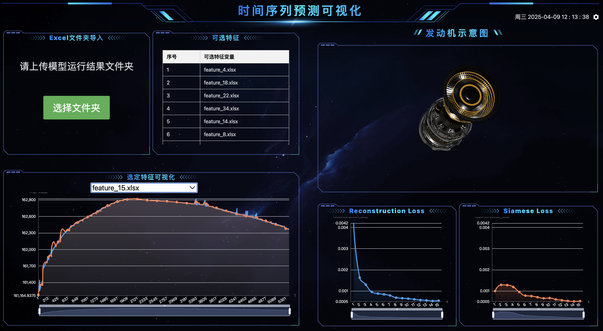

# Time_Series_Forecasting_Based_on_Timer_Model

### 本项目只用于2025“建龙钢铁”计算机设计大赛项目：东北大学——基于大规模时间序列预测模型的航空发动机评估系统

### 说明
采用LTSM(大规模时间序列预测模型)对收集到的原始发动机数据进行处理，将模型导出的结果文件打包成文件夹上传即可将结果可视化

内容包括：
- 所有特征值列表
- 发动机示意图
- 各个特征文件预测值及真实值的比较
- 本次预测结果的 Reduction loss 和 Siamese loss 的可视化

### 页面预览：

### 运行
本项目已用vercel部署，请见[time-series-forecasting-based-on-timer-model](https://time-series-forecasting-based-on-timer-model.vercel.app/#/)

### 编码环境下运行
git clone本项目之后，打开终端输入cd指令到项目文件夹下，执行 `npm install` 安装依赖

执行 `npm run dev` 以查看